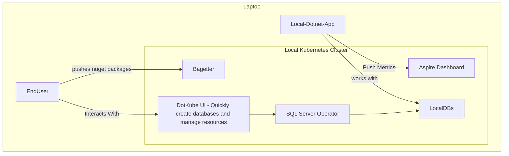

# DotKube: Enhancing .NET for Kubernetes

Welcome to **DotKube**, a GitHub organization designed to bridge the gaps between Kubernetes and .NET by providing tools, templates, and solutions to streamline cloud-native application development and infrastructure management.

DotKube is all about enabling developers to work efficiently with Kubernetes using .NET while leveraging a suite of open-source tools and solutions tailored to modern DevOps workflows.

---

## 🚧 Warning: Work in Progress

**DotKube is a brand-new initiative, and development is still in its early stages.** While we are excited about the vision and potential of this project, please note that many of the features and tools outlined here are still being actively worked on. Contributions, feedback, and patience are greatly appreciated as we bring these ideas to life!

---

## 🚀 What DotKube Plans to Offer

### 1. **Helm SDK in C#**
   - A unique Helm SDK written in C# for developers looking to manage Helm charts programmatically.
   - Proof of concept available, with plans for expanded functionality.

---

### 2. **Helm Charts & Operators**
   - **SQL Server Helm Chart & Operator**  
     A Kubernetes operator for managing SQL Server instances, free and open source, deployable via the CLI.
   - **Bagetter Helm Chart & Operator**  
     Deploy **[Bagetter](https://www.bagetter.com/)** with ease using Helm or a custom operator.
   - **Azure Pipeline Agents Helm Chart & Operator**  
     Self-host Azure Pipeline agents using a dedicated Helm chart.
   - **Aspire Dashboard Helm Chart & Operator**  
     Deploy **[Aspire Dashboard](https://aspiredashboard.com/)** with our Helm chart.

---

### 3. **.NET Operator Template**
   - Create custom Kubernetes operators using a .NET template.
   - Available via the CLI.

---

### 4. **Comprehensive CLI**
   - Install essential tools like Podman, Kind, kubectl, Helm, k9s, Azure Data Studio, Headlamp, and more.
   - Preconfigured templates for .NET applications with features like Aspire Host, Tekton Pipelines, and Taskfiles.
   - Simplify containerization for .NET applications with a CLI wrapper around:
     ```bash
     dotnet publish --os linux --arch x64 /t:PublishContainer
     ```
   - Quickly install the latest LTS version of .NET, PowerShell Core, Aspire, and other essential tools.
   - Generate Terraform CDK projects in C# with a simple CLI command.
   - Quickly spin up a fully configured Kind (Kubernetes IN Docker) cluster tailored for development.

---

## 📊 Architecture Overview

Below is a high-level architecture of a typical DotKube setup:



This diagram illustrates:

- The **Laptop** hosting the **Local Kubernetes Cluster**.
- Components within the cluster like:
  - **Aspire Dashboard** for metrics and visualization.
  - **Bagetter**, a NuGet package app.
  - **SQL Server Operator** managing local databases.
  - **DotKube UI** for database creation and resource management.
- Interactions between:
  - **Local .NET Apps** pushing metrics to **Aspire Dashboard** and working with local databases.
  - **End Users** interacting with **Bagetter** and **DotKube UI**, which integrates with the **SQL Server Operator**.

---

## 💡 Vision

DotKube aims to empower developers by offering a seamless integration of Kubernetes and .NET, with an opinionated approach that removes complexity and accelerates productivity. Whether you're a Kubernetes newbie or a seasoned DevOps engineer, DotKube provides the tools and templates you need to succeed.

---

## 🛠️ Get Started

Check out our repositories and start exploring the tools tailored for your Kubernetes and .NET workflows. Have feedback or ideas? Feel free to contribute or start a discussion!

👉 **[Explore DotKube Repositories](https://github.com/DotKube)**

---

## 🤝 Contributing

We welcome contributions! Please see our [CONTRIBUTING.md](CONTRIBUTING.md) for guidelines on how to get involved.

---

## 📄 License

All tools and repositories within the DotKube organization are licensed under [MIT License](LICENSE).

---

DotKube: The missing piece for Kubernetes in .NET.