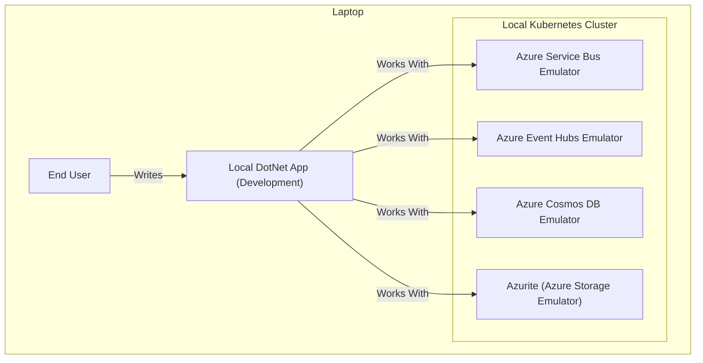
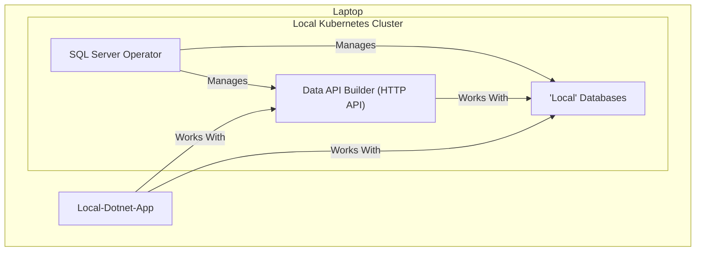
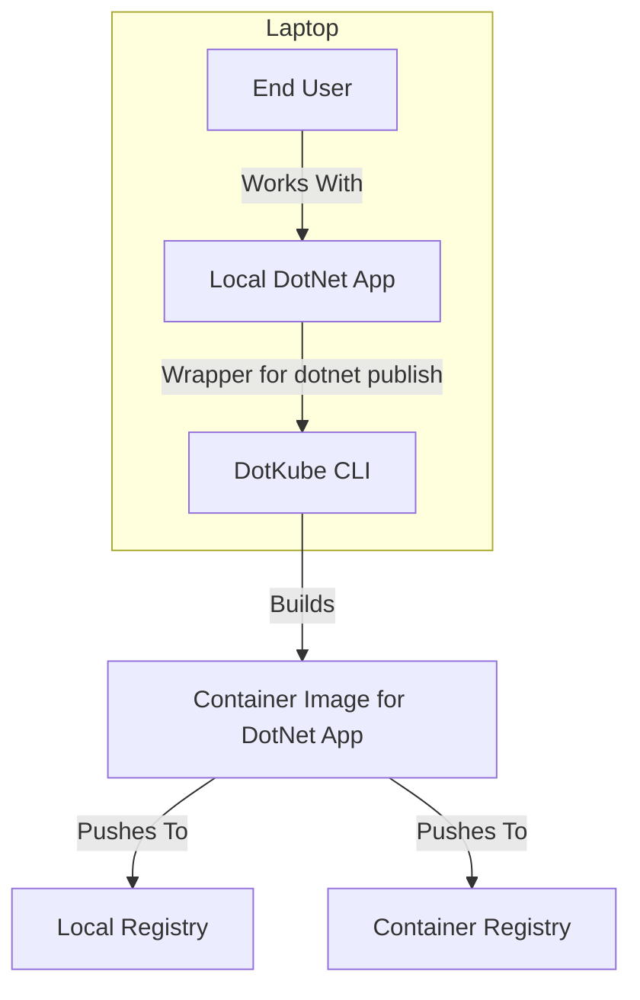
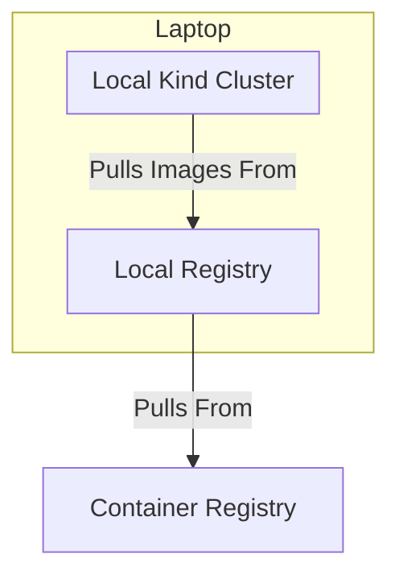
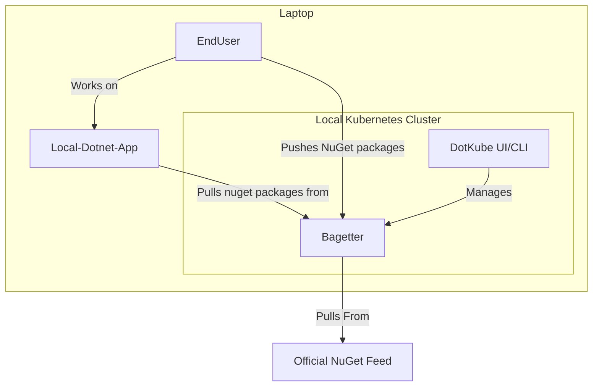
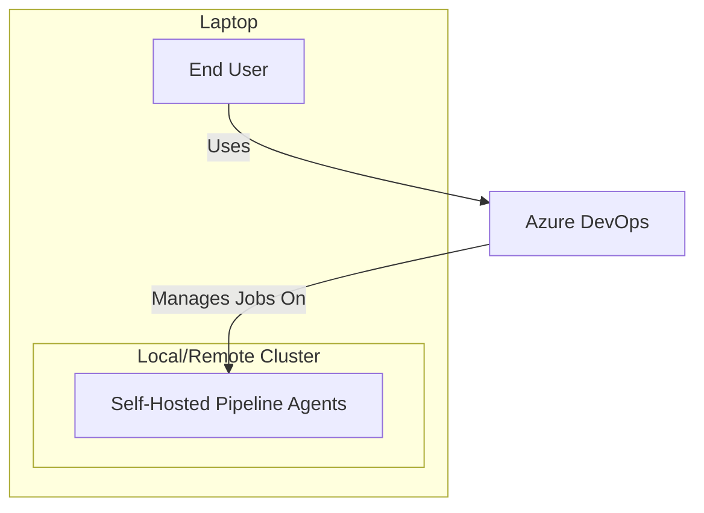

# DotKube: Enhancing .NET for Kubernetes

Welcome to **DotKube**, a GitHub organization designed to bridge the gaps between Kubernetes and .NET by providing tools, templates, and solutions to streamline cloud-native application development and infrastructure management.

DotKube is all about enabling developers to work efficiently with Kubernetes using .NET while leveraging a suite of open-source tools and solutions tailored to modern DevOps workflows.

---

## 🚧 Warning: Work in Progress

**DotKube is a brand-new initiative, and development is still in its early stages.** While we are excited about the vision and potential of this project, please note that many of the features and tools outlined here are still being actively worked on. Contributions, feedback, and patience are greatly appreciated as we bring these ideas to life!

---

## 🚀 What DotKube Plans to Offer

### 1. **Helm SDK in C#**
   - A unique Helm SDK written in C# for developers looking to manage Helm charts programmatically.
   - Proof of concept available, with plans for expanded functionality.

---

### 2. **Helm Charts & Operators**
   - **SQL Server Helm Chart & Operator**  
     Manage SQL Server instances in Kubernetes with a free and open-source operator, deployable via the CLI.
   - **Bagetter Helm Chart & Operator**  
     Seamlessly deploy **[Bagetter](https://www.bagetter.com/)** with Helm or a custom operator.
   - **Azure Pipeline Agents Helm Chart & Operator**  
     Self-host Azure Pipeline agents with ease using a dedicated Helm chart.
   - **Aspire Dashboard Helm Chart & Operator**  
     Deploy **[Aspire Dashboard](https://aspiredashboard.com/)** effortlessly using Helm.

---

### 3. **Curated Images**
   - A set of pre-configured, secure, and optimized container images tailored for development and production workflows, including:
     - SQL Server images with advanced features such as Full-Text Search (FTS), PolyBase, and High Availability (HA).
     - Self-hosted pipeline agent images.
     - AlmaLinux-based SQL Server images.
     - Custom .NET base images for optimized application development and deployment.
   - These images simplify setup for complex requirements while adhering to best practices.

---

### 4. **.NET Operator Template**
   - Quickly create custom Kubernetes operators using a .NET template.
   - Available via the CLI for easy scaffolding.

---

### 5. **Comprehensive CLI**
   - Install essential tools like Podman, Kind, kubectl, Helm, k9s, Azure Data Studio, Headlamp, and more.
   - Quickly scaffold templated Docker Compose files for local workflows, with templates for:
     - SQL Server
     - Docker Registry
     - Azure Service Bus Emulator
     - Azure Event Hubs Emulator
     - Cosmos DB Emulator
     - SQS Emulator
     - etc...
   - Preconfigured templates for .NET applications with features like Aspire Host, Tekton Pipelines, and Taskfiles.
   - Simplify containerization for .NET applications with a CLI wrapper around:
     ```bash
     dotnet publish --os linux --arch x64 /t:PublishContainer
     ```
   - Quickly install the latest LTS version of .NET, PowerShell Core, Aspire, and other essential tools.
   - Generate Terraform CDK projects in C# with a simple CLI command.
   - Quickly spin up a fully configured Kind (Kubernetes IN Docker) cluster tailored for development.

---

## 💡 Vision

DotKube aims to empower developers by offering a seamless integration of Kubernetes and .NET, with an opinionated approach that removes complexity and accelerates productivity. Whether you're a Kubernetes newbie or a seasoned DevOps engineer, DotKube provides the tools and templates you need to succeed.

---

## 📊 Architecture Overview

DotKube simplifies local development and Kubernetes management by integrating various tools and workflows into an intuitive architecture. Below are visual representations of key components and their interactions.

---

### **Azure Service Emulators**



**Description:**  
This setup includes Azure service emulators running inside a local Kubernetes cluster. Developers write and run their .NET applications on their laptops, which interact with the emulated services for development purposes.

---

### **Databases**



**Description:**  
This architecture features a SQL Server Operator managing local databases and a Data API Builder (DAB) for creating HTTP APIs. The local .NET app interacts with both the DAB and databases for streamlined development.

---

### **DotKube CLI - Image Generator**



**Description:**  
The DotKube CLI streamlines the containerization of .NET applications. It wraps around `dotnet publish` to create container images, which are then pushed to a local or remote container registry.

---

### **Local Registry**



**Description:**  
The local Kubernetes cluster uses a local registry to manage container images. The local registry syncs with an external container registry for pulling base images.

---

### **NuGet Packages**



**Description:**  
The Bagetter application in the cluster manages NuGet packages. Developers pull packages for their local .NET applications from Bagetter, which itself syncs with the official NuGet feed.

---

### **Self-Hosted Pipelines**



**Description:**  
Self-hosted pipeline agents are deployed within a Kubernetes cluster, allowing Azure DevOps to manage jobs locally or remotely. This setup gives developers full control over their CI/CD workflows.

---

### Description

This architecture includes:

- **Laptop**: The development environment hosting the Kubernetes cluster.
- **Local Kubernetes Cluster**: A cluster running:
  - **Aspire Dashboard**: Visualizing application metrics.
  - **Bagetter**: A NuGet package management app.
  - **SQL Server Operator**: Managing SQL Server instances.
  - **Local Databases**: Databases managed by the operator or other tools.
  - **DotKube UI**: A UI to simplify database creation and resource management.
- **Interactions**:
  - **Local .NET Apps**: Push metrics to Aspire Dashboard and interact with local databases.
  - **End Users**: Interact with Bagetter for package management and DotKube UI for resource operations.

--- 

## 🤝 Contributing

We welcome contributions! Please see our [CONTRIBUTING.md](CONTRIBUTING.md) for guidelines on how to get involved.

---

## 📄 License

All tools and repositories within the DotKube organization are licensed under [MIT License](LICENSE).

---

DotKube: The missing piece for Kubernetes in .NET.