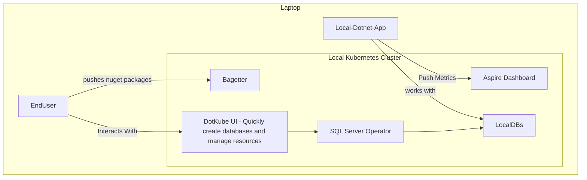

# DotKube: Enhancing .NET for Kubernetes

Welcome to **DotKube**, a GitHub organization designed to bridge the gaps between Kubernetes and .NET by providing tools, templates, and solutions to streamline cloud-native application development and infrastructure management.

DotKube is all about enabling developers to work efficiently with Kubernetes using .NET while leveraging a suite of open-source tools and solutions tailored to modern DevOps workflows.

---

## 🚀 What DotKube Plans to Offer

### 1. **Helm SDK in C#**
   - A unique Helm SDK written in C# for developers looking to manage Helm charts programmatically.
   - Proof of concept available, with plans for expanded functionality.

---

### 2. **Comprehensive CLI for Tool Installation**
   - Quickly install essential tools like:
     - Podman & Podman-Docker
     - Kind
     - kubectl, kubens, kubectx
     - Helm & Helm Unit Testing Plugin
     - k9s
   - Install GUI tools such as:
     - Azure Data Studio
     - Headlamp
     - SQL Server Management Studio (Windows)

---

### 3. **Free & Open-Source SQL Server Operator**
   - A Kubernetes operator for managing SQL Server instances.
   - Completely free and open source, deployable via the DotKube CLI.

---

### 4. **Bagetter Helm Chart & Operator**
   - Deploy **[Bagetter](https://www.bagetter.com/)** with ease using Helm or a custom operator.

---

### 5. **Azure Pipeline Agents Helm Chart**
   - Self-host Azure Pipeline agents using a dedicated Helm chart.

---

### 6. **Aspire Dashboard Helm Chart**
   - Deploy **[Aspire Dashboard](https://aspiredashboard.com/)** with our Helm chart for effortless setup.

---

### 7. **.NET Operator Template**
   - Create custom Kubernetes operators using a .NET template.
   - Available via a single command in the CLI.

---

### 8. **.NET Application Templates**
   - Preconfigured templates for .NET applications featuring:
     - Aspire Host
     - Tekton Pipelines
     - Taskfiles for automation

---

### 9. **Containerization CLI for .NET Applications**
   - Simplify containerization with a CLI wrapper for:
     ```bash
     dotnet publish --os linux --arch x64 /t:PublishContainer
     ```

---

### 10. **Install Latest LTS Tools via CLI**
   - Quickly install:
     - Latest LTS version of .NET
     - PowerShell Core
     - Aspire
     - And more

---

### 11. **C# Terraform CDK Generator**
   - Generate Terraform CDK projects in C# with a simple CLI command.

---

### 12. **Opinionated Kind Cluster Creation**
   - Quickly spin up a fully configured Kind (Kubernetes IN Docker) cluster tailored for development.
   - Deployable using our CLI.

---


---

## 🛠️ Get Started

Check out our repositories and start exploring the tools tailored for your Kubernetes and .NET workflows. Have feedback or ideas? Feel free to contribute or start a discussion!

👉 **[Explore DotKube Repositories](https://github.com/DotKube)**

---


Here’s the updated section of the README where the Mermaid chart is added:

---

## 💡 Vision

DotKube aims to empower developers by offering a seamless integration of Kubernetes and .NET, with an opinionated approach that removes complexity and accelerates productivity. Whether you're a Kubernetes newbie or a seasoned DevOps engineer, DotKube provides the tools and templates you need to succeed.

---

## 📊 Architecture Overview

Below is a high-level architecture of a typical DotKube setup:



This diagram illustrates:

- The **Laptop** hosting the **Local Kubernetes Cluster**.
- Components within the cluster like:
  - **Aspire Dashboard** for metrics and visualization.
  - **Bagetter**, a NuGet package app.
  - **SQL Server Operator** managing local databases.
  - **DotKube UI** for database creation and resource management.
- Interactions between:
  - **Local .NET Apps** pushing metrics to **Aspire Dashboard** and working with local databases.
  - **End Users** interacting with **Bagetter** and **DotKube UI**, which integrates with the **SQL Server Operator**.

---

## 🤝 Contributing

We welcome contributions! Please see our [CONTRIBUTING.md](CONTRIBUTING.md) for guidelines on how to get involved.

---

## 📄 License

All tools and repositories within the DotKube organization are licensed under [MIT License](LICENSE).

---

DotKube: The missing piece for Kubernetes in .NET.